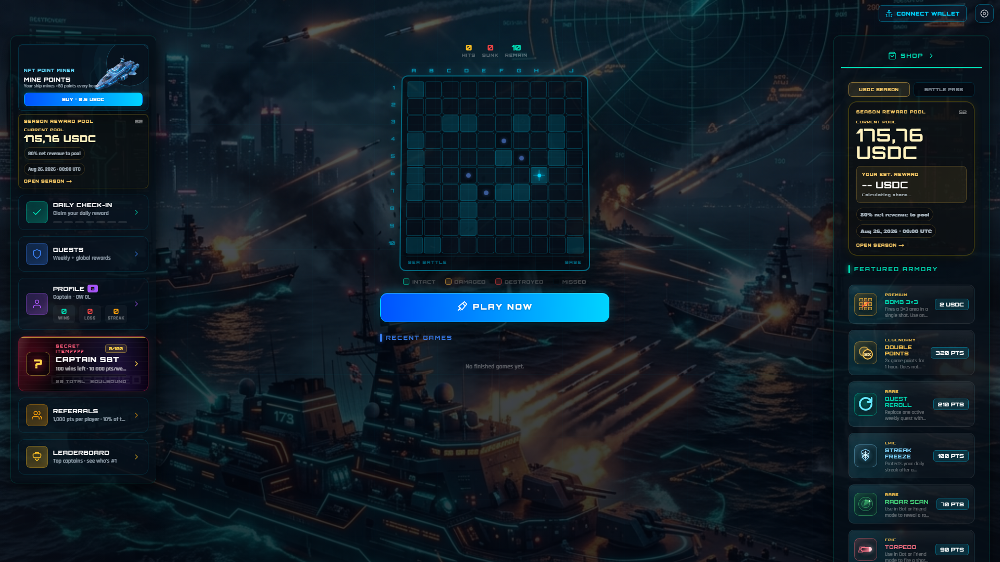
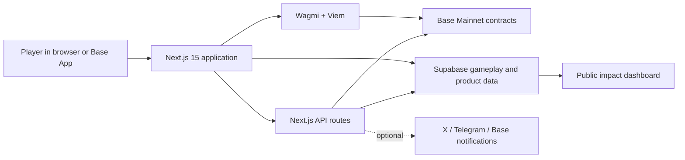
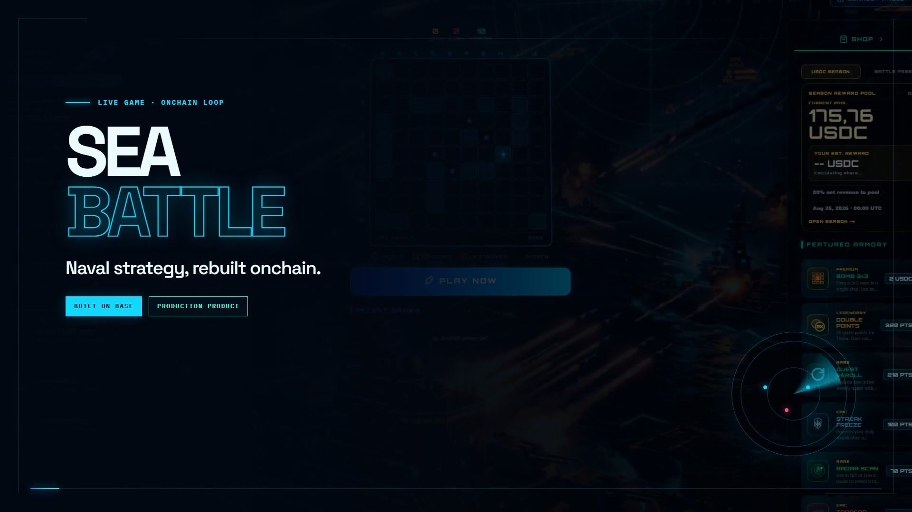

# Sea Battle

Production-ready naval strategy game on Base Mainnet.

[Live app](https://seabattle.top) ·
[Play](https://seabattle.top/play) ·
[Public statistics](https://seabattle.top/stats) ·
[Grant film](https://seabattle.top/grant-video/sea-battle-base-grant-film.mp4) ·
[SeaBattleV7 on BaseScan](https://basescan.org/address/0x8de75fbc38b1e47e53fb2e85791c935f5f653aa6)

[](https://seabattle.top)

Sea Battle turns the familiar Battleship ruleset into a repeatable onchain
game loop: play, compete, progress, collect, and return. The product combines
fast offchain gameplay with Base transactions for stakes, settlement,
collectibles, rewards, and attribution.

> [!WARNING]
> The public application runs on Base Mainnet. Wallet actions can use real ETH
> and USDC. Browsing the interface and statistics does not require a wallet.

## Project goals

- Make an onchain game understandable to players who already know Battleship.
- Support three distinct entry points: solo practice, private PvP, and USDC
  wager battles.
- Build retention through seasons, quests, check-ins, progression, inventory,
  leaderboards, and creator rewards.
- Keep economic actions verifiable on Base while keeping turn-based gameplay
  responsive.
- Report adoption with production telemetry instead of wallet connections
  alone.

## What is working

- Solo battles against an AI opponent.
- Private friend matches shared by game ID or link.
- USDC wager rooms with create, join, settle, claim, cancel, and stale-game
  refund flows.
- Base Account and injected-wallet connections through Wagmi.
- Seasonal points, daily check-ins, quests, referrals, and leaderboard.
- Armory, boosters, Fleet NFTs, Fleet Miner slots, and Captain SBT flows.
- Creator submissions, creator rewards, social connections, and share rewards.
- Public production analytics at `/stats`.
- Base/Farcaster Mini App metadata at `/.well-known/farcaster.json`.

## Working demo

The following production endpoints were smoke-checked from the public internet
on July 30, 2026:

| Demo | URL | What to verify |
| --- | --- | --- |
| Main product | [seabattle.top](https://seabattle.top) | Current responsive interface, wallet entry, quests, profile, and navigation |
| Game modes | [seabattle.top/play](https://seabattle.top/play) | Solo, private PvP, and USDC wager entry points |
| Statistics | [seabattle.top/stats](https://seabattle.top/stats) | Production traction, methodology, gameplay, economy, and community metrics |
| Mini App manifest | [farcaster.json](https://seabattle.top/.well-known/farcaster.json) | App metadata and production media |
| Main contract | [SeaBattleV7 on BaseScan](https://basescan.org/address/0x8de75fbc38b1e47e53fb2e85791c935f5f653aa6) | Base Mainnet contract activity |

### Suggested reviewer path

1. Open the [live product](https://seabattle.top) on desktop or mobile.
2. Select **Play now** to inspect all three battle modes.
3. Connect a wallet only if you want to test a transaction.
4. Open the [statistics dashboard](https://seabattle.top/stats) to review the
   evidence and methodology.
5. Watch the [59-second grant film](https://seabattle.top/grant-video/sea-battle-base-grant-film.mp4).
6. Inspect the main contract on
   [BaseScan](https://basescan.org/address/0x8de75fbc38b1e47e53fb2e85791c935f5f653aa6).

## Production evidence

The committed snapshot in
[`app/stats/grant-stats.json`](app/stats/grant-stats.json) covers production
records through July 29, 2026.

| Metric | Value |
| --- | ---: |
| Unique human wallets | 266 |
| Games recorded | 1,609 |
| Finished games | 1,482 |
| Completion rate | 92.1% |
| Shots recorded | 58,749 |
| Games recorded in July | 1,023 |
| Unique player wallets in July game records | 62 |

**The value 62 is a wallet count, not a game count.** One wallet can create or
play many games; July contains 1,023 game records across 62 unique player
wallets.

The dashboard separates three adoption lenses:

- **Tracked MAU** includes attributable product activity across gameplay,
  profiles, seasons, economy, social, creator, inventory, boosters, and
  referrals.
- **Core-action MAU** excludes update-only profile, season, inventory, and
  booster timestamps.
- **Unique game wallets** counts human wallets directly present in game
  records.

System addresses, the zero address, and the internal bot sentinel are excluded
from human-wallet metrics.

## Architecture



The hybrid design keeps board state and turn updates responsive in Supabase,
while contracts handle the actions that need onchain guarantees: wagers,
claims, rewards, collectibles, and ownership.

## Technology

- Next.js 15 App Router and React 19.
- TypeScript with strict checking.
- Wagmi, Viem, Base Account, and ERC-8021 builder attribution.
- Farcaster Mini App SDK and Quick Auth.
- Supabase for game state, analytics, seasons, inventory, and community data.
- Solidity contracts deployed on Base Mainnet.
- Remotion for the reproducible grant film.
- Playwright for production screenshots.
- PptxGenJS for the grant presentation.

## Quick start

### Requirements

- Node.js 20 or newer.
- npm 10 or newer.
- A Supabase project for functional local gameplay.
- A Base-compatible wallet for transaction testing.

### 1. Clone and install

```bash
git clone https://github.com/fuelghoir/seawar01.git
cd seawar01
npm ci
```

### 2. Create the local environment file

macOS or Linux:

```bash
cp .example.env .env.local
```

Windows PowerShell:

```powershell
Copy-Item .example.env .env.local
```

At minimum, fill in:

```dotenv
NEXT_PUBLIC_APP_URL=http://localhost:3000
NEXT_PUBLIC_URL=http://localhost:3000
NEXT_PUBLIC_SUPABASE_URL=https://YOUR_PROJECT.supabase.co
NEXT_PUBLIC_SUPABASE_ANON_KEY=YOUR_PUBLIC_ANON_KEY
NEXT_PUBLIC_BASE_RPC_URL=https://mainnet.base.org
NEXT_PUBLIC_SEABATTLE_V7_CONTRACT_ADDRESS=0x8de75fbc38b1e47e53fb2e85791c935f5f653aa6
```

The repository contains production Base contract defaults, but the values are
listed explicitly in `.example.env` so a reviewer can see which deployment is
being used.

### 3. Run locally

```bash
npm run dev
```

Open [http://localhost:3000](http://localhost:3000).

### 4. Verify the project

```bash
npm run lint
npm run build
```

To run the optimized build:

```bash
npm run start
```

The project currently uses lint, TypeScript checks inside `next build`, and a
manual smoke test. There is no automated unit-test suite yet.

## Environment variables

The complete, commented template is in [`.example.env`](.example.env).

| Group | Variables | Required when |
| --- | --- | --- |
| Public application | `NEXT_PUBLIC_APP_URL`, `NEXT_PUBLIC_URL` | Canonical URLs, Mini App metadata, OAuth callbacks |
| Supabase client | `NEXT_PUBLIC_SUPABASE_URL`, `NEXT_PUBLIC_SUPABASE_ANON_KEY` | Local gameplay and production data |
| Base | `NEXT_PUBLIC_BASE_RPC_URL`, `NEXT_PUBLIC_BUILDER_CODE`, public contract addresses | Custom RPC, attribution, deployment overrides |
| Supabase server | `SUPABASE_SERVICE_ROLE_KEY` | Admin APIs, rewards, analytics generation |
| Transaction sponsorship | `NEXT_PUBLIC_PAYMASTER_URL` | Sponsored transaction calls |
| Contract signers | `DROP_CLAIM_SIGNER_PRIVATE_KEY`, `CHALLENGE_SIGNER_PRIVATE_KEY`, `CAPTAIN_SBT_SIGNER_PRIVATE_KEY`, `DISCOUNT_SIGNER_PRIVATE_KEY` | Server-signed claims and protected contract actions |
| Administration | `ADMIN_WALLETS`, `ADMIN_SESSION_SECRET` | `/admin` access |
| Social integrations | X and Telegram variables | OAuth, quests, social verification |
| Notifications | Base notification, push, and VAPID variables | Optional notification delivery |

> [!CAUTION]
> `SUPABASE_SERVICE_ROLE_KEY`, private keys, signer keys, OAuth secrets, and
> admin secrets are server-only. Never prefix them with `NEXT_PUBLIC_`, expose
> them to the browser, or commit a populated environment file.

## Database setup

Production uses Supabase Postgres.

1. Create a separate Supabase project.
2. Run [`scripts/supabase-schema.sql`](scripts/supabase-schema.sql) as the
   baseline game schema.
3. Apply the feature SQL files under `scripts/` for the product areas you want
   to enable: points, seasons, referrals, challenges, creator program, social
   connections, collectibles, and reward claims.
4. Review and apply the RLS policies in
   [`scripts/supabase-security-policies.sql`](scripts/supabase-security-policies.sql)
   and the feature-specific security files.
5. Put the project URL and anon key in `.env.local`. Add the service-role key
   only for server-side features.

The SQL files are incremental production migrations. Review them before
applying them to an existing database and never test migrations against the
production project.

## Base Mainnet contracts

Network: Base Mainnet, chain ID `8453`.

| Component | Address |
| --- | --- |
| SeaBattleV7 | [`0x8de7…3aa6`](https://basescan.org/address/0x8de75fbc38b1e47e53fb2e85791c935f5f653aa6) |
| SeaBattleChallengeV1 | [`0x082d…6311`](https://basescan.org/address/0x082d8eaa1fc738d5950e6b751026d3d265866311) |
| SignatureDropClaim | [`0x3901…5a5b`](https://basescan.org/address/0x39016cE335546b6ab9776a1cC78cf210f84f5a5b) |
| FleetPassNFT | [`0xc1d7…2923`](https://basescan.org/address/0xc1d76b124bc8f819f9c727caa277aaec72412923) |
| FleetMinerSlots | [`0x3994…aaDc`](https://basescan.org/address/0x3994f95D86CA11Fb698b846F3788E3dBb115aaDc) |
| CaptainSBT | [`0xeEf5…8ac`](https://basescan.org/address/0xeEf5dCD159E164CF75Cd245644f07Bc052F998ac) |
| Base USDC | [`0x8335…2913`](https://basescan.org/address/0x833589fCD6eDb6E08f4c7C32D4f71b54bdA02913) |

Current deployment notes are in
[`contracts/DEPLOY-V7.md`](contracts/DEPLOY-V7.md). V4–V6 documents are retained
as historical migration records.

## Demo materials

[](https://seabattle.top/grant-video/sea-battle-base-grant-film.mp4)

- [Public 59-second grant film](https://seabattle.top/grant-video/sea-battle-base-grant-film.mp4)
- [Home screenshot](public/app-screenshots/01-home.png)
- [Game-mode screenshot](public/app-screenshots/02-game-modes.png)
- [Leaderboard screenshot](public/app-screenshots/03-leaderboard.png)
- [Desktop production screenshot](public/grant-video/app-desktop.png)
- [Public statistics dashboard](https://seabattle.top/stats)
- [Committed statistics snapshot](app/stats/grant-stats.json)
- [Remotion film source](video/SeaBattleGrantFilm.tsx)

Generated high-resolution files are written to the ignored `deliverables/`
directory so they do not bloat normal development clones.

## Reproduce the grant materials

The analytics command needs `NEXT_PUBLIC_SUPABASE_URL` and the server-only
`SUPABASE_SERVICE_ROLE_KEY`.

```bash
npm run stats:grant
```

Start the application in another terminal before capturing:

```bash
npm run dev
npm run capture:grant
```

Use `CAPTURE_BASE_URL` to capture another deployment and
`CHROME_EXECUTABLE_PATH` if Chrome is not in a standard location.

Generate the presentation and film:

```bash
npm run deck:grant
npm run video:still
npm run video:render
```

Outputs:

- `deliverables/screenshots/`
- `deliverables/Sea_Battle_Base_Builder_Grant.pptx`
- `deliverables/Sea_Battle_Base_Grant_preview.png`
- `deliverables/Sea_Battle_Base_Grant_Film.mp4`

Open Remotion Studio for editable preview:

```bash
npm run video:preview
```

## Grant use of funds

The current request is 5 ETH.

| Allocation | Amount | Purpose |
| --- | ---: | --- |
| Prize and activity pool | 35% · 1.75 ETH | Bring more players into more matches and increase recurring activity |
| Advertising and growth | 25% · 1.25 ETH | Acquire and reactivate players |
| Gameplay mechanics | 20% · 1.00 ETH | Improve retention, competition, and game depth |
| Dedicated developers | 20% · 1.00 ETH | Increase shipping speed and operational reliability |

## Repository map

```text
app/                 Next.js pages, API routes, UI, and public stats
app/contracts/       Runtime contract addresses and ABIs
contracts/           Solidity sources and deployment notes
scripts/             Database SQL, deployments, analytics, captures, and deck
video/               Remotion grant-film source
public/              Product art, screenshots, metadata, and public demo film
docs/                Security and operational notes
metadata/            Generated NFT/SBT metadata
```

## Deployment

1. Configure the production environment variables in Vercel or another
   Node-compatible platform.
2. Set `NEXT_PUBLIC_APP_URL` and `NEXT_PUBLIC_URL` to the final HTTPS origin.
3. Run `npm run build`.
4. Deploy the Next.js application.
5. Sign the Mini App `accountAssociation` for the deployment domain and update
   `farcaster.config.ts` before publishing a fork to Base or Farcaster.
6. Verify the live app, `/play`, `/stats`, and
   `/.well-known/farcaster.json`.

Do not deploy contracts from a wallet that holds unrelated assets. Contract
deployment scripts use `DEPLOYER_PRIVATE_KEY` and Base Mainnet gas.
